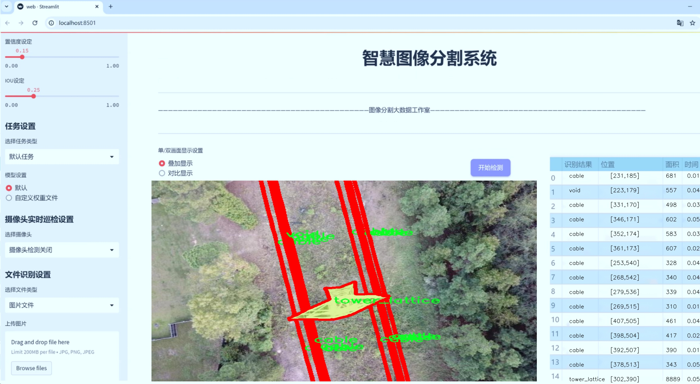
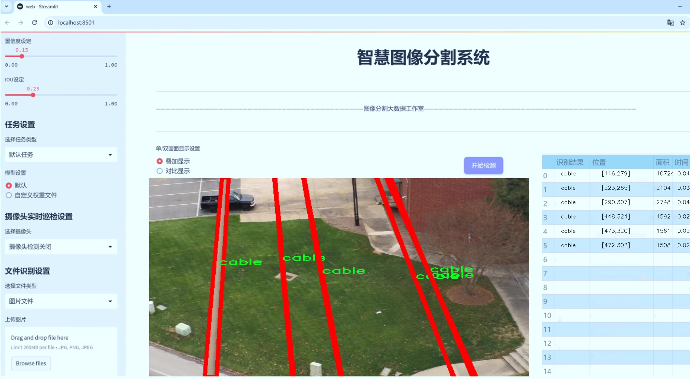
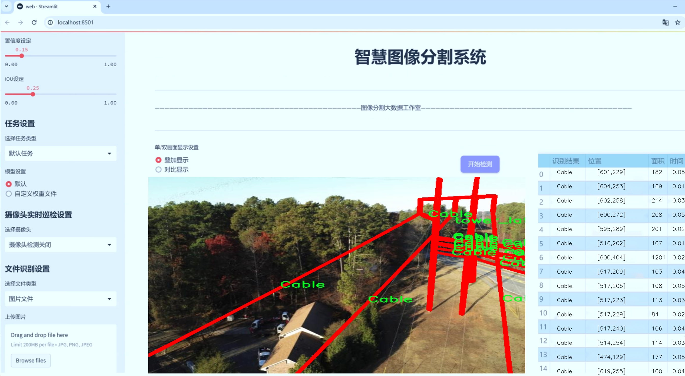
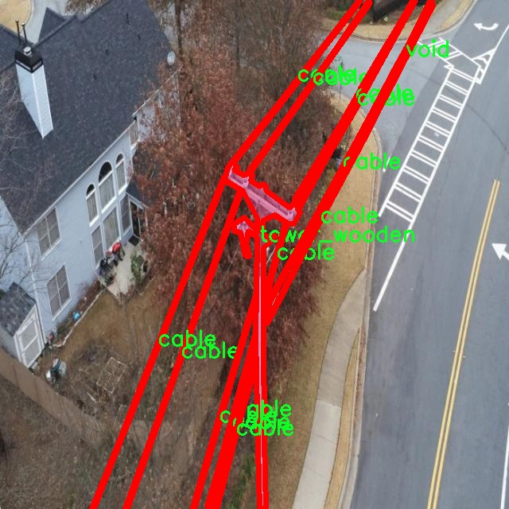
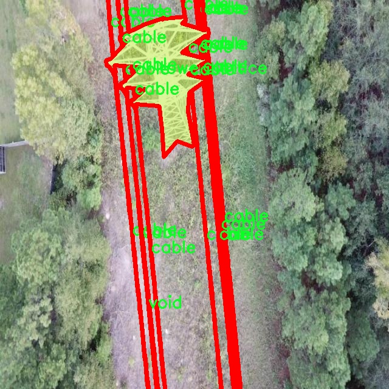
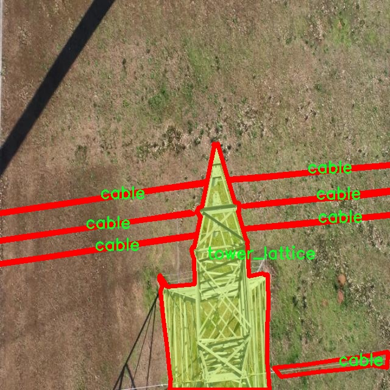
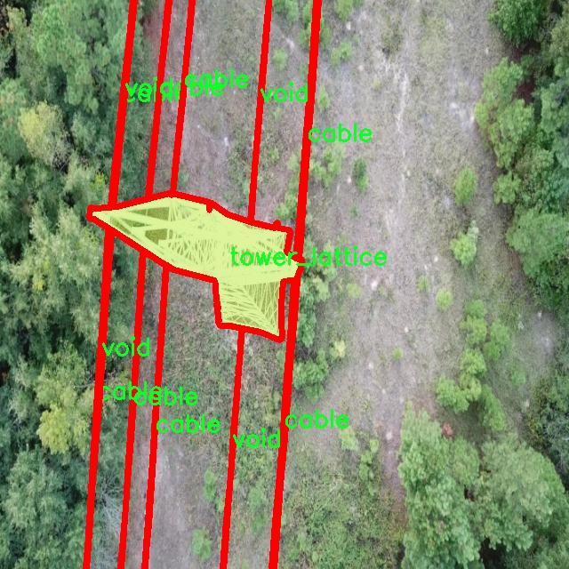
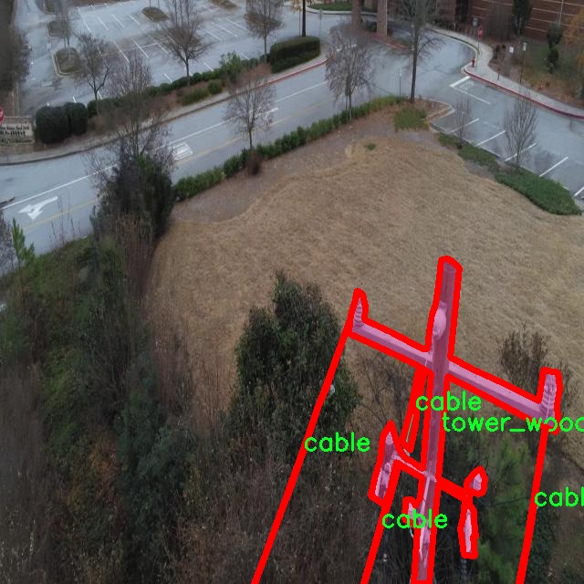

# 电缆塔结构分割系统源码＆数据集分享
 [yolov8-seg-C2f-ContextGuided＆yolov8-seg-C2f-Parc等50+全套改进创新点发刊_一键训练教程_Web前端展示]

### 1.研究背景与意义

项目参考[ILSVRC ImageNet Large Scale Visual Recognition Challenge](https://gitee.com/YOLOv8_YOLOv11_Segmentation_Studio/projects)

项目来源[AAAI Global Al lnnovation Contest](https://kdocs.cn/l/cszuIiCKVNis)

研究背景与意义

随着城市化进程的加快，电力基础设施的建设与维护变得愈发重要。电缆塔作为电力传输系统中的关键组成部分，其结构的安全性与稳定性直接关系到电力供应的可靠性。因此，如何高效、准确地对电缆塔及其周边结构进行监测与维护，成为了当前电力行业亟待解决的问题。传统的人工巡检方式不仅效率低下，而且容易受到人为因素的影响，导致漏检或误检现象的发生。基于此，利用先进的计算机视觉技术，尤其是深度学习中的实例分割技术，对电缆塔结构进行自动化检测与分割，具有重要的现实意义。

YOLO（You Only Look Once）系列模型以其快速、准确的目标检测能力在计算机视觉领域取得了显著的成果。YOLOv8作为该系列的最新版本，结合了多种改进技术，进一步提升了模型在复杂场景下的检测性能。然而，针对电缆塔结构的实例分割任务，现有的YOLOv8模型仍存在一定的局限性。电缆塔的多样性和复杂性使得其在图像中的表现形式各异，且背景环境的变化也会对模型的检测效果产生影响。因此，基于YOLOv8的改进研究，将有助于提升电缆塔结构分割的准确性和鲁棒性。

本研究所使用的数据集sst_dataset包含1200张图像，涵盖了6个类别：电缆、塔架（包括格栅塔、木塔）及空白区域。这些数据的多样性为模型的训练提供了丰富的样本，有助于提升模型对不同类型电缆塔的识别能力。通过对数据集的深入分析与处理，结合YOLOv8的特性，研究者可以针对电缆塔的特征进行定制化的改进，从而实现更为精准的实例分割。

此外，电缆塔结构的实例分割不仅可以为电力行业的巡检提供技术支持，还可以为后续的维护决策提供数据依据。通过对电缆塔结构的实时监测，能够及时发现潜在的安全隐患，降低事故发生的风险，保障电力供应的稳定性。同时，该技术的推广应用也将推动电力行业向智能化、自动化的方向发展，提高整体运营效率。

综上所述，基于改进YOLOv8的电缆塔结构分割系统的研究，不仅具有重要的理论价值，也具备广泛的应用前景。通过对电缆塔的自动化检测与分割，可以为电力行业的安全管理提供有效的技术手段，推动电力基础设施的智能化升级，为构建安全、稳定的电力网络贡献力量。

### 2.图片演示







##### 注意：由于此博客编辑较早，上面“2.图片演示”和“3.视频演示”展示的系统图片或者视频可能为老版本，新版本在老版本的基础上升级如下：（实际效果以升级的新版本为准）

  （1）适配了YOLOV8的“目标检测”模型和“实例分割”模型，通过加载相应的权重（.pt）文件即可自适应加载模型。

  （2）支持“图片识别”、“视频识别”、“摄像头实时识别”三种识别模式。

  （3）支持“图片识别”、“视频识别”、“摄像头实时识别”三种识别结果保存导出，解决手动导出（容易卡顿出现爆内存）存在的问题，识别完自动保存结果并导出到tempDir中。

  （4）支持Web前端系统中的标题、背景图等自定义修改，后面提供修改教程。

  另外本项目提供训练的数据集和训练教程,暂不提供权重文件（best.pt）,需要您按照教程进行训练后实现图片演示和Web前端界面演示的效果。

### 3.视频演示

[3.1 视频演示](https://www.bilibili.com/video/BV1YLCUYuEip/)

### 4.数据集信息展示

##### 4.1 本项目数据集详细数据（类别数＆类别名）

nc: 6
names: ['Cable', 'cable', 'tower_lattice', 'tower_tucohy', 'tower_wooden', 'void']


##### 4.2 本项目数据集信息介绍

数据集信息展示

在现代计算机视觉领域，尤其是在目标检测和分割任务中，数据集的质量和多样性对模型的性能至关重要。本研究中所使用的“sst_dataset”数据集，专门设计用于训练和改进YOLOv8-seg模型，以实现电缆塔结构的精确分割。该数据集的构建考虑到了电缆塔结构的多样性和复杂性，旨在为深度学习模型提供丰富的训练样本，从而提高其在实际应用中的表现。

“sst_dataset”包含六个主要类别，分别为“Cable”、“cable”、“tower_lattice”、“tower_tucohy”、“tower_wooden”和“void”。这些类别的选择反映了电缆塔结构的不同组成部分及其在实际场景中的多样性。首先，“Cable”与“cable”这两个类别虽然名称相似，但在数据集中可能代表不同类型的电缆，例如不同材料或用途的电缆，这种细分有助于模型更好地理解和区分不同的电缆特征。其次，“tower_lattice”、“tower_tucohy”和“tower_wooden”则分别代表三种不同结构的电缆塔，前者通常用于高压输电线路，具有较强的承载能力和稳定性；而“tower_tucohy”可能指代一种特定设计的电缆塔，适用于特定环境或负载要求；“tower_wooden”则代表传统的木质电缆塔，虽然在现代应用中逐渐被替代，但在某些地区仍然具有重要的历史和实用价值。

“void”类别的引入则为数据集的完整性提供了保障，标识出背景或无关区域，使得模型在进行分割时能够有效区分目标与非目标区域。这种设计不仅提高了模型的鲁棒性，也为后续的后处理和结果分析提供了便利。

在数据集的构建过程中，确保样本的多样性和代表性是至关重要的。为了实现这一目标，数据集中的图像来源于不同的地理位置和环境条件，涵盖了各种光照、天气和视角变化。这种多样性使得模型在训练过程中能够学习到更为丰富的特征，从而在面对实际应用场景时表现出更强的适应能力。

此外，数据集中的每个类别都经过精确标注，确保了训练数据的高质量。标注过程采用了先进的图像标注工具，结合人工审核，确保每个目标的边界框和分割掩膜都准确无误。这一过程不仅提高了数据集的可靠性，也为后续的模型训练提供了坚实的基础。

综上所述，“sst_dataset”不仅是一个针对电缆塔结构分割任务的高质量数据集，更是一个经过精心设计和构建的资源，旨在推动YOLOv8-seg模型在电缆塔结构分割领域的研究与应用。通过对多样化类别的细致划分和高质量标注，该数据集为电缆塔的自动化检测与维护提供了强有力的支持，助力于智能电网和基础设施的可持续发展。











### 5.全套项目环境部署视频教程（零基础手把手教学）

[5.1 环境部署教程链接（零基础手把手教学）](https://www.bilibili.com/video/BV1jG4Ve4E9t/?vd_source=bc9aec86d164b67a7004b996143742dc)


[5.2 安装Python虚拟环境创建和依赖库安装视频教程链接（零基础手把手教学）](https://www.bilibili.com/video/BV1nA4VeYEze/?vd_source=bc9aec86d164b67a7004b996143742dc)

### 6.手把手YOLOV8-seg训练视频教程（零基础小白有手就能学会）

[6.1 手把手YOLOV8-seg训练视频教程（零基础小白有手就能学会）](https://www.bilibili.com/video/BV1cA4VeYETe/?vd_source=bc9aec86d164b67a7004b996143742dc)


按照上面的训练视频教程链接加载项目提供的数据集，运行train.py即可开始训练



     Epoch   gpu_mem       box       obj       cls    labels  img_size
     1/200     0G   0.01576   0.01955  0.007536        22      1280: 100%|██████████| 849/849 [14:42<00:00,  1.04s/it]
               Class     Images     Labels          P          R     mAP@.5 mAP@.5:.95: 100%|██████████| 213/213 [01:14<00:00,  2.87it/s]
                 all       3395      17314      0.994      0.957      0.0957      0.0843

     Epoch   gpu_mem       box       obj       cls    labels  img_size
     2/200     0G   0.01578   0.01923  0.007006        22      1280: 100%|██████████| 849/849 [14:44<00:00,  1.04s/it]
               Class     Images     Labels          P          R     mAP@.5 mAP@.5:.95: 100%|██████████| 213/213 [01:12<00:00,  2.95it/s]
                 all       3395      17314      0.996      0.956      0.0957      0.0845

     Epoch   gpu_mem       box       obj       cls    labels  img_size
     3/200     0G   0.01561    0.0191  0.006895        27      1280: 100%|██████████| 849/849 [10:56<00:00,  1.29it/s]
               Class     Images     Labels          P          R     mAP@.5 mAP@.5:.95: 100%|███████   | 187/213 [00:52<00:00,  4.04it/s]
                 all       3395      17314      0.996      0.957      0.0957      0.0845


### 7.50+种全套YOLOV8-seg创新点代码加载调参视频教程（一键加载写好的改进模型的配置文件）

[7.1 50+种全套YOLOV8-seg创新点代码加载调参视频教程（一键加载写好的改进模型的配置文件）](https://www.bilibili.com/video/BV1Hw4VePEXv/?vd_source=bc9aec86d164b67a7004b996143742dc)

### 8.YOLOV8-seg图像分割算法原理

原始YOLOV8-seg算法原理

YOLOv8-seg作为YOLO系列的最新发展，代表了目标检测和分割领域的一次重要进步。该算法不仅继承了YOLO系列的高效性和准确性，还在处理复杂场景和小目标检测方面进行了显著改进。YOLOv8的核心理念是将目标检测与图像分割相结合，通过高效的网络结构和先进的训练策略，旨在提升在各种环境下的目标识别能力。

首先，YOLOv8-seg的网络结构由四个主要模块组成：输入端、主干网络、Neck端和输出端。输入端负责对输入图像进行预处理，包括Mosaic数据增强、自适应图片缩放和灰度填充等操作。这些预处理步骤不仅增强了数据的多样性，还提高了模型对不同环境和条件下目标的适应能力。通过这些手段，YOLOv8-seg能够有效减少训练过程中因数据不足而导致的过拟合现象。

在主干网络中，YOLOv8-seg采用了先进的卷积结构，包括Conv、C2f和SPPF模块。这些模块通过多层卷积和池化操作，提取图像的多层次特征。C2f模块的设计灵感来源于YOLOv7中的E-ELAN结构，采用跨层分支连接的方式，增强了模型的梯度流动性，从而改善了特征提取的效果。SPPF模块则通过多尺度最大池化，进一步提升了网络对复杂特征的抽象能力，使得YOLOv8-seg在面对不同大小和形状的目标时，能够更好地进行特征捕捉。

Neck端的设计基于PAN（Path Aggregation Network）结构，通过上采样、下采样和特征拼接的方式，融合不同尺度的特征图。这一过程确保了网络能够有效整合来自主干网络的多层次信息，从而提升对目标的定位和分类能力。Neck端的特征融合不仅增强了网络的上下文理解能力，还为后续的检测和分割任务提供了更加丰富的特征信息。

在输出端，YOLOv8-seg采用了解耦的检测头结构，这一创新设计使得分类和回归过程得以独立进行。通过这种解耦方式，网络能够更加专注于各自的任务，显著提高了在复杂场景下的定位精度和分类准确性。此外，YOLOv8-seg引入了Task-Aligned Assigner方法，对分类分数和回归分数进行加权匹配，进一步优化了正样本的选择过程。这种方法有效减少了模型在训练过程中的误匹配现象，从而提升了整体性能。

值得注意的是，YOLOv8-seg在处理小目标检测时表现尤为突出。针对小目标漏检的问题，YOLOv8-seg在网络中添加了一个更小的检测头，以增强对小目标的感知能力。这一改进使得网络能够更有效地捕捉到复杂水面环境中的小目标漂浮物，克服了传统YOLO系列在此类场景下的局限性。

在损失函数的选择上，YOLOv8-seg使用了MPDIoU（Multi-Point Distance Intersection over Union）损失函数替代了传统的CIoU（Complete Intersection over Union）损失函数。这一替换不仅提高了模型的泛化能力，还增强了对目标边界的精准度，使得网络在复杂环境下的表现更加稳定。MPDIoU损失函数通过考虑多个关键点之间的距离关系，能够更全面地评估预测框与真实框之间的重叠程度，从而提升了目标检测的准确性。

总的来说，YOLOv8-seg算法在设计上充分考虑了目标检测和分割任务的复杂性，通过多层次的特征提取、有效的特征融合以及创新的解耦检测头结构，显著提升了模型在复杂环境下的表现。其在小目标检测和复杂背景处理方面的优势，使得YOLOv8-seg成为一种极具潜力的目标检测和分割工具，能够广泛应用于实时监控、自动驾驶、无人机巡检等多个领域。随着技术的不断进步，YOLOv8-seg无疑将在未来的研究和应用中发挥更为重要的作用。


### 9.系统功能展示（检测对象为举例，实际内容以本项目数据集为准）

图9.1.系统支持检测结果表格显示

  图9.2.系统支持置信度和IOU阈值手动调节

  图9.3.系统支持自定义加载权重文件best.pt(需要你通过步骤5中训练获得)

  图9.4.系统支持摄像头实时识别

  图9.5.系统支持图片识别

  图9.6.系统支持视频识别

  图9.7.系统支持识别结果文件自动保存

  图9.8.系统支持Excel导出检测结果数据


### 10.50+种全套YOLOV8-seg创新点原理讲解（非科班也可以轻松写刊发刊，V11版本正在科研待更新）

#### 10.1 由于篇幅限制，每个创新点的具体原理讲解就不一一展开，具体见下列网址中的创新点对应子项目的技术原理博客网址【Blog】：


[10.1 50+种全套YOLOV8-seg创新点原理讲解链接](https://gitee.com/qunmasj/good)

#### 10.2 部分改进模块原理讲解(完整的改进原理见上图和技术博客链接)【如果此小节的图加载失败可以通过CSDN或者Github搜索该博客的标题访问原始博客，原始博客图片显示正常】
### 深度学习基础
卷积神经网络通过使用具有共享参数的卷积运算显著降低了模型的计算开销和复杂性。在LeNet、AlexNet和VGG等经典网络的驱动下，卷积神经网络现在已经建立了一个完整的系统，并在深度学习领域形成了先进的卷积神经网络模型。

感受野注意力卷积RFCBAMConv的作者在仔细研究了卷积运算之后获得了灵感。对于分类、目标检测和语义分割任务，一方面，图像中不同位置的对象的形状、大小、颜色和分布是可变的。在卷积操作期间，卷积核在每个感受野中使用相同的参数来提取信息，而不考虑来自不同位置的差分信息。这限制了网络的性能，这已经在最近的许多工作中得到了证实。

另一方面，卷积运算没有考虑每个特征的重要性，这进一步影响了提取特征的有效性，并最终限制了模型的性能。此外，注意力机制允许模型专注于重要特征，这可以增强特征提取的优势和卷积神经网络捕获详细特征信息的能力。因此，注意力机制在深度学习中得到了广泛的应用，并成功地应用于各个领域。

通过研究卷积运算的内在缺陷和注意力机制的特点，作者认为现有的空间注意力机制从本质上解决了卷积运算的参数共享问题，但仍局限于对空间特征的认知。对于较大的卷积核，现有的空间注意力机制并没有完全解决共享参数的问题。此外，他们无法强调感受野中每个特征的重要性，例如现有的卷积块注意力模块（CBAM）和 Coordinate注意力（CA）。

因此，[参考该博客提出了一种新的感受野注意力机制（RFA）](https://qunmasj.com)，它完全解决了卷积核共享参数的问题，并充分考虑了感受野中每个特征的重要性。通过RFA设计的卷积运算（RFAConv）是一种新的卷积运算，可以取代现有神经网络中的标准卷积运算。RFAConv通过添加一些参数和计算开销来提高网络性能。

大量关于Imagnet-1k、MS COCO和VOC的实验已经证明了RFAConv的有效性。作为一种由注意力构建的新型卷积运算，它超过了由CAM、CBAM和CA构建的卷积运算（CAMConv、CBAMConv、CAConv）以及标准卷积运算。

此外，为了解决现有方法提取感受野特征速度慢的问题，提出了一种轻量级操作。在构建RFAConv的过程中，再次设计了CA和CBAM的升级版本，并进行了相关实验。作者认为当前的空间注意力机制应该将注意力放在感受野空间特征上，以促进当前空间注意力机制的发展，并再次增强卷积神经网络架构的优势。


### 卷积神经网络架构
出色的神经网络架构可以提高不同任务的性能。卷积运算作为卷积神经网络的一种基本运算，推动了人工智能的发展，并为车辆检测、无人机图像、医学等先进的网络模型做出了贡献。He等人认为随着网络深度的增加，该模型将变得难以训练并产生退化现象，因此他们提出了残差连接来创新卷积神经网络架构的设计。Huang等人通过重用特征来解决网络梯度消失问题，增强了特征信息，他们再次创新了卷积神经网络架构。

通过对卷积运算的详细研究，Dai等人认为，具有固定采样位置的卷积运算在一定程度上限制了网络的性能，因此提出了Deformable Conv，通过学习偏移来改变卷积核的采样位置。在Deformable Conv的基础上，再次提出了Deformable Conv V2和Deformable Conv V3，以提高卷积网络的性能。

Zhang等人注意到，组卷积可以减少模型的参数数量和计算开销。然而，少于组内信息的交互将影响最终的网络性能。1×1的卷积可以与信息相互作用。然而，这将带来更多的参数和计算开销，因此他们提出了无参数的“通道Shuffle”操作来与组之间的信息交互。

Ma等人通过实验得出结论，对于参数较少的模型，推理速度不一定更快，对于计算量较小的模型，推理也不一定更快。经过仔细研究提出了Shufflenet V2。

YOLO将输入图像划分为网格，以预测对象的位置和类别。经过不断的研究，已经提出了8个版本的基于YOLO的目标检测器，如YOLOv5、YOLOv7、YOLOv8等。上述卷积神经网络架构已经取得了巨大的成功。然而，它们并没有解决提取特征过程中的参数共享问题。本文的工作从注意力机制开始，从一个新的角度解决卷积参数共享问题。

### 注意力机制
注意力机制被用作一种提高网络模型性能的技术，使其能够专注于关键特性。注意力机制理论已经在深度学习中建立了一个完整而成熟的体系。Hu等人提出了一种Squeeze-and-Excitation（SE）块，通过压缩特征来聚合全局通道信息，从而获得与每个通道对应的权重。Wang等人认为，当SE与信息交互时，单个通道和权重之间的对应关系是间接的，因此设计了高效通道注Efficient Channel Attention力（ECA），并用自适应kernel大小的一维卷积取代了SE中的全连接（FC）层。Woo等人提出了卷积块注意力模块（CBAM），它结合了通道注意力和空间注意力。作为一个即插即用模块，它可以嵌入卷积神经网络中，以提高网络性能。

尽管SE和CBAM已经提高了网络的性能。Hou等人仍然发现压缩特征在SE和CBAM中丢失了太多信息。因此，他们提出了轻量级Coordinate注意力（CA）来解决SE和CBAM中的问题。Fu等人计了一个空间注意力模块和通道注意力模块，用于扩展全卷积网络（FCN），分别对空间维度和通道维度的语义相关性进行建模。Zhang等人在通道上生成不同尺度的特征图，以建立更有效的通道注意力机制。

本文从一个新的角度解决了标准卷积运算的参数共享问题。这就是将注意力机制结合起来构造卷积运算。尽管目前的注意力机制已经获得了良好的性能，但它们仍然没有关注感受野的空间特征。因此，设计了具有非共享参数的RFA卷积运算，以提高网络的性能。


#### 回顾标准卷积
以标准卷积运算为基础构建卷积神经网络，通过共享参数的滑动窗口提取特征信息，解决了全连接层构建的神经网络的固有问题（即参数数量大、计算开销高）。

设表示输入特征图，其中、和分别表示特征图的通道数、高度和宽度。为了能够清楚地展示卷积核提取特征信息的过程，以为例。提取每个感受野slider的特征信息的卷积运算可以表示如下：


这里，表示在每次卷积slider操作之后获得的值，表示在每个slider内的相应位置处的像素值。表示卷积核，表示卷积核中的参数数量，表示感受野slider的总数。

可以看出，每个slider内相同位置的特征共享相同的参数。因此，标准的卷积运算无法感知不同位置带来的差异信息，这在一定程度上限制了卷积神经网络的性能。

#### 回顾空间注意力
目前，空间注意力机制使用通过学习获得的注意力图来突出每个特征的重要性。与上一节类似，以为例。突出关键特征的空间注意力机制可以简单地表达如下：


这里，表示在加权运算之后获得的值。和分别表示输入特征图和学习注意力图在不同位置的值，是输入特征图的高度和宽度的乘积，表示像素值的总数。一般来说，整个过程可以简单地表示在图1中。


#### 空间注意力与标准卷积
众所周知，将注意力机制引入卷积神经网络可以提高网络的性能。通过标准的卷积运算和对现有空间注意力机制的仔细分析。作者认为空间注意力机制本质上解决了卷积神经网络的固有缺点，即共享参数的问题。

目前，该模型最常见的卷积核大小为1×1和3×3。引入空间注意力机制后用于提取特征的卷积操作是1×1或3×3卷积操作。这个过程可以直观地显示出来。空间注意力机制被插入到1×1卷积运算的前面。通过注意力图对输入特征图进行加权运算（Re-weight“×”），最后通过1×1卷积运算提取感受野的slider特征信息。

整个过程可以简单地表示如下：


 

这里，卷积核仅表示一个参数值。如果将的值作为一个新的卷积核参数，那么有趣的是，通过1×1卷积运算提取特征时的参数共享问题得到了解决。然而，空间注意力机制的传说到此结束。当空间注意力机制被插入到3×3卷积运算的前面时。具体情况如下：


如上所述，如果取的值。作为一种新的卷积核参数，上述方程完全解决了大规模卷积核的参数共享问题。然而，最重要的一点是，卷积核在每个感受野slider中提取将共享部分特征的特征。换句话说，在每个感受野slider内都会有重叠。

经过仔细分析发现，，…，空间注意力图的权重在每个slider内共享。因此，空间注意机制不能解决大规模卷积核共享参数的问题，因为它们不注意感受野的空间特征。在这种情况下，空间注意力机制是有限的。
#### 创新空间注意力与标准卷积
RFA是为了解决空间注意力机制问题而提出的，创新了空间注意力。使用与RFA相同的思想，一系列空间注意力机制可以再次提高性能。RFA设计的卷积运算可以被视为一种轻量级的即插即用模块，以取代标准卷积，从而提高卷积神经网络的性能。因此，作者认为空间注意力机制和标准卷积在未来将有一个新的春天。

感受野的空间特征：

现在给出感受野空间特征的定义。它是专门为卷积核设计的，并根据kernel大小动态生成，如图2所示，以3×3卷积核为例。


在图2中，“空间特征”表示原始特征图，等于空间特征。“感受野空间特征”表示变换后的特征，该特征由每个感受野slider滑块组成，并且不重叠。也就是说，“感受野空间特征”中的每个3×3大小的slider表示提取原始3×3卷积特征时所有感觉野slider的特征。

#### 感受野注意力卷积(RFA):

关于感受野空间特征，该博客的作者提出了感受野注意（RFA），它不仅强调了感受野slider内各种特征的重要性，而且还关注感受野空间特性，以彻底解决卷积核参数共享的问题。感受野空间特征是根据卷积核的大小动态生成的，因此，RFA是卷积的固定组合，不能脱离卷积运算的帮助，卷积运算同时依赖RFA来提高性能。

因此，作者提出了感受野注意力卷积（RFAConv）。具有3×3大小卷积核的RFAConv的总体结构如图3所示。


目前，提取感受野特征最常用的方法速度较慢，因此经过不断探索提出了一种快速的方法，通过分组卷积来取代原来的方法。

具体来说，根据感受野大小，使用相应的组卷积大小来动态生成展开特征。尽管与原始的无参数方法（如Pytorch提供的nn.Unfld()）相比，该方法添加了一些参数，但速度要快得多。

注意：正如在上一节中提到的，当原始的3×3卷积核提取特征时，感受野空间特征中的每个3×3大小的窗口表示所有感受野滑块的特征。但在快速分组卷积提取感受野特征后，由于原始方法太慢，它们会被映射到新的特征中。

最近的一些工作已经证明信息交互可以提高网络性能。类似地，对于RFAConv，与感受野特征信息交互以学习注意力图可以提高网络性能，但与每个感受野特征交互将带来额外的计算开销。为了确保少量的计算开销和参数数量，通过探索使用AvgPool池化每个感受野特征的全局信息，然后通过1×1组卷积运算与信息交互。最后，softmax用于强调感受野特征中每个特征的重要性。通常，RFA的计算可以表示为：


表示分组卷积，表示卷积核的大小，代表规范化，表示输入特征图，是通过将注意力图与变换的感受野空间特征相乘而获得的。

与CBAM和CA不同，RFA可以为每个感受野特征生成注意力图。标准卷积受到卷积神经网络性能的限制，因为共享参数的卷积运算对位置带来的差异信息不敏感。RFA完全可以解决这个问题，具体细节如下：


由于RFA获得的特征图是“调整形状”后不重叠的感受野空间特征，因此通过池化每个感受野滑块的特征信息来学习学习的注意力图。换句话说，RFA学习的注意力图不再在每个感受野slider内共享，并且是有效的。这完全解决了现有的CA和CBAM对大尺寸kernel的注意力机制中的参数共享问题。

同时，RFA给标准卷积核带来了相当大的好处，但调整形状后，特征的高度和宽度是k倍，需要进行k×k的stride卷积运算，才能提取特征信息。RFAConv创新了标准卷积运算。

此外，空间注意力机制将得到升级，因为作者认为现有的空间注意力机制应该专注于感受野空间特征，以提高网络的性能。众所周知，基于自注意力机制的网络模型取得了巨大的成功，因为它解决了卷积参数共享的问题，并对远程信息进行了建模，但基于自注意力机理的方法给模型带来了巨大的计算开销和复杂性。作者认为通过将一些现有空间注意力机制的注意力放在感受野空间特征中，它以轻量级的方式解决了自注意力机制的问题。

答案如下：

将关注感受野空间特征的空间注意力与卷积相匹配，完全解决了卷积参数共享的问题；

当前的空间注意力机制本身具有考虑远距离信息的特点，它们通过全局平均池化或全局最大池化来获得全局信息，这在一定程度上考虑了远距离信息。


为此，作者设计了一种新的CBAM和CA，称为RFACBAM和RFACA，它专注于感受野的空间特征。与RFA类似，使用stride为k的k×k的最终卷积运算来提取特征信息，具体结构如图4和图5所示，将这2种新的卷积方法称为RFCBAMConv和RFCAConv。比较原始的CBAM，使用SE注意力来代替RFCBAM中的CAM。因为这样可以减少计算开销。


此外，在RFCBAM中，通道和空间注意力不是在单独的步骤中执行的，因为通道和空间注意力是同时加权的，从而允许在每个通道上获得的注意力图是不同的。


### 11.项目核心源码讲解（再也不用担心看不懂代码逻辑）

#### 11.1 train.py

以下是经过简化和注释的核心代码部分：

```python
import os
import torch
import yaml
from ultralytics import YOLO  # 导入YOLO模型库

if __name__ == '__main__':  # 确保该模块被直接运行时才执行以下代码
    # 设置训练参数
    workers = 1  # 数据加载工作进程数
    batch = 8  # 每个批次的样本数量
    device = "0" if torch.cuda.is_available() else "cpu"  # 检查是否有可用的GPU

    # 获取数据集配置文件的绝对路径
    data_path = abs_path(f'datasets/data/data.yaml', path_type='current')

    # 将路径转换为Unix风格
    unix_style_path = data_path.replace(os.sep, '/')
    # 获取数据集目录路径
    directory_path = os.path.dirname(unix_style_path)

    # 读取YAML配置文件
    with open(data_path, 'r') as file:
        data = yaml.load(file, Loader=yaml.FullLoader)

    # 修改数据集路径
    if 'train' in data and 'val' in data and 'test' in data:
        data['train'] = directory_path + '/train'  # 训练集路径
        data['val'] = directory_path + '/val'      # 验证集路径
        data['test'] = directory_path + '/test'    # 测试集路径

        # 将修改后的数据写回YAML文件
        with open(data_path, 'w') as file:
            yaml.safe_dump(data, file, sort_keys=False)

    # 加载YOLO模型配置和预训练权重
    model = YOLO(r"C:\codeseg\codenew\50+种YOLOv8算法改进源码大全和调试加载训练教程（非必要）\改进YOLOv8模型配置文件\yolov8-seg-C2f-Faster.yaml").load("./weights/yolov8s-seg.pt")

    # 开始训练模型
    results = model.train(
        data=data_path,  # 指定训练数据的配置文件路径
        device=device,  # 指定训练设备
        workers=workers,  # 数据加载工作进程数
        imgsz=640,  # 输入图像大小
        epochs=100,  # 训练的轮数
        batch=batch,  # 每个批次的样本数量
    )
```

### 代码说明：
1. **导入库**：导入必要的库，包括`os`、`torch`、`yaml`和`YOLO`模型。
2. **主程序入口**：通过`if __name__ == '__main__':`确保代码块仅在直接运行时执行。
3. **设置训练参数**：
   - `workers`：指定数据加载的工作进程数。
   - `batch`：每个批次的样本数量。
   - `device`：根据是否有可用的GPU选择设备。
4. **获取数据集配置文件路径**：使用`abs_path`函数获取数据集配置文件的绝对路径。
5. **读取和修改YAML文件**：
   - 读取YAML文件并解析内容。
   - 修改训练、验证和测试集的路径。
   - 将修改后的内容写回YAML文件。
6. **加载YOLO模型**：指定模型配置文件和预训练权重进行加载。
7. **训练模型**：调用`model.train`方法开始训练，传入相关参数。

该程序文件`train.py`主要用于训练YOLO（You Only Look Once）目标检测模型。首先，程序导入了必要的库，包括操作系统库`os`、深度学习框架`torch`、YAML解析库`yaml`、YOLO模型库`ultralytics`以及用于图形界面的`matplotlib`。

在程序的主入口部分，首先设置了一些训练参数。`workers`设为1，表示数据加载时使用的工作进程数量。`batch`设为8，表示每个训练批次的样本数量，这个值可以根据计算机的显存和内存进行调整。如果显存不足，可以适当降低这个值。接着，程序会检测是否有可用的GPU，如果有，则将设备设置为“0”，否则使用CPU。

接下来，程序通过`abs_path`函数获取数据集配置文件`data.yaml`的绝对路径，并将其转换为Unix风格的路径。然后，程序读取该YAML文件的内容，并检查其中是否包含训练、验证和测试数据的路径。如果存在这些路径，程序会将它们修改为相对于当前目录的路径，并将修改后的内容写回到YAML文件中。

在模型加载部分，程序创建了一个YOLO模型实例，并加载了指定的模型配置文件和预训练权重。需要注意的是，不同的YOLO模型有不同的大小和设备要求，因此如果遇到内存不足的错误，可以尝试使用其他的模型配置文件。

最后，程序调用`model.train`方法开始训练模型，传入的数据配置文件路径、设备、工作进程数量、输入图像大小（640x640）、训练的轮数（100个epoch）以及批次大小（8）。通过这些设置，程序将开始进行模型的训练过程。

#### 11.2 ultralytics\utils\callbacks\wb.py

以下是经过简化和注释的核心代码部分，主要功能是使用WandB记录YOLO模型训练过程中的指标和可视化图表。

```python
# 导入必要的库
from ultralytics.utils import SETTINGS, TESTS_RUNNING
from ultralytics.utils.torch_utils import model_info_for_loggers

try:
    # 确保当前不是在测试模式下
    assert not TESTS_RUNNING  
    # 确保WandB集成已启用
    assert SETTINGS['wandb'] is True  
    import wandb as wb  # 导入WandB库

    # 确保WandB库的版本有效
    assert hasattr(wb, '__version__')  

    import numpy as np  # 导入NumPy库
    import pandas as pd  # 导入Pandas库

    _processed_plots = {}  # 用于记录已处理的图表

except (ImportError, AssertionError):
    wb = None  # 如果导入失败或断言失败，则将wb设置为None


def _custom_table(x, y, classes, title='Precision Recall Curve', x_title='Recall', y_title='Precision'):
    """
    创建并记录自定义的精确度-召回率曲线可视化。
    
    参数:
        x (List): x轴的值，长度为N。
        y (List): y轴的值，长度为N。
        classes (List): 每个点的类别标签，长度为N。
        title (str): 图表标题，默认为'Precision Recall Curve'。
        x_title (str): x轴标签，默认为'Recall'。
        y_title (str): y轴标签，默认为'Precision'。

    返回:
        (wandb.Object): 适合记录的WandB对象，展示自定义的指标可视化。
    """
    # 创建数据框
    df = pd.DataFrame({'class': classes, 'y': y, 'x': x}).round(3)
    fields = {'x': 'x', 'y': 'y', 'class': 'class'}
    string_fields = {'title': title, 'x-axis-title': x_title, 'y-axis-title': y_title}
    # 返回WandB表格对象
    return wb.plot_table('wandb/area-under-curve/v0',
                         wb.Table(dataframe=df),
                         fields=fields,
                         string_fields=string_fields)


def _plot_curve(x, y, names=None, id='precision-recall', title='Precision Recall Curve', x_title='Recall', y_title='Precision', num_x=100, only_mean=False):
    """
    记录指标曲线可视化。

    参数:
        x (np.ndarray): x轴数据点，长度为N。
        y (np.ndarray): y轴数据点，形状为CxN，C为类别数。
        names (list): 类别名称，长度为C。
        id (str): 记录数据的唯一标识符，默认为'precision-recall'。
        title (str): 可视化图表的标题，默认为'Precision Recall Curve'。
        x_title (str): x轴标签，默认为'Recall'。
        y_title (str): y轴标签，默认为'Precision'。
        num_x (int): 可视化的插值数据点数量，默认为100。
        only_mean (bool): 是否仅绘制均值曲线，默认为True。
    """
    # 创建新的x值
    if names is None:
        names = []
    x_new = np.linspace(x[0], x[-1], num_x).round(5)

    # 创建用于记录的数组
    x_log = x_new.tolist()
    y_log = np.interp(x_new, x, np.mean(y, axis=0)).round(3).tolist()

    if only_mean:
        # 仅记录均值曲线
        table = wb.Table(data=list(zip(x_log, y_log)), columns=[x_title, y_title])
        wb.run.log({title: wb.plot.line(table, x_title, y_title, title=title)})
    else:
        # 记录每个类别的曲线
        classes = ['mean'] * len(x_log)
        for i, yi in enumerate(y):
            x_log.extend(x_new)  # 添加新的x值
            y_log.extend(np.interp(x_new, x, yi))  # 插值y到新的x
            classes.extend([names[i]] * len(x_new))  # 添加类别名称
        wb.log({id: _custom_table(x_log, y_log, classes, title, x_title, y_title)}, commit=False)


def on_fit_epoch_end(trainer):
    """在每个训练周期结束时记录训练指标和模型信息。"""
    wb.run.log(trainer.metrics, step=trainer.epoch + 1)  # 记录指标
    # 记录图表
    _log_plots(trainer.plots, step=trainer.epoch + 1)
    _log_plots(trainer.validator.plots, step=trainer.epoch + 1)
    if trainer.epoch == 0:
        wb.run.log(model_info_for_loggers(trainer), step=trainer.epoch + 1)  # 记录模型信息


def on_train_end(trainer):
    """在训练结束时保存最佳模型作为artifact。"""
    _log_plots(trainer.validator.plots, step=trainer.epoch + 1)
    _log_plots(trainer.plots, step=trainer.epoch + 1)
    art = wb.Artifact(type='model', name=f'run_{wb.run.id}_model')  # 创建artifact
    if trainer.best.exists():
        art.add_file(trainer.best)  # 添加最佳模型文件
        wb.run.log_artifact(art, aliases=['best'])  # 记录artifact
    wb.run.finish()  # 结束WandB运行


# 定义回调函数
callbacks = {
    'on_fit_epoch_end': on_fit_epoch_end,
    'on_train_end': on_train_end} if wb else {}
```

### 代码说明：
1. **导入模块**：导入了必要的库，包括WandB、NumPy和Pandas。
2. **异常处理**：确保WandB集成可用，并处理可能的导入错误。
3. **自定义表格函数**：`_custom_table`函数用于创建精确度-召回率曲线的可视化表格。
4. **绘制曲线函数**：`_plot_curve`函数根据输入数据生成曲线，并将其记录到WandB。
5. **训练结束时的回调**：`on_fit_epoch_end`和`on_train_end`函数在训练过程中记录指标和图表，并在训练结束时保存最佳模型。

这个程序文件是用于集成WandB（Weights and Biases）库，以便在训练YOLO模型时记录和可视化训练过程中的各种指标和图表。文件的主要功能是通过回调函数在训练的不同阶段（如预训练开始、每个训练周期结束等）记录模型的性能数据。

首先，文件导入了一些必要的模块，包括Ultralytics库中的设置和工具函数。它尝试导入WandB库，并进行一些基本的检查，比如确认WandB集成是否启用以及WandB库是否正确安装。如果导入失败，WandB将被设置为None，后续的记录操作将不会执行。

接下来，定义了几个函数来处理数据的可视化和记录。`_custom_table`函数用于创建和记录一个自定义的精确度-召回曲线（Precision-Recall Curve），它接受x轴和y轴的数据、类别标签以及图表的标题等参数，并返回一个适合WandB记录的对象。`_plot_curve`函数则生成并记录一个指标曲线的可视化，支持记录平均值或每个类别的数据。

`_log_plots`函数用于记录输入字典中的图表，如果在指定的步骤中尚未记录过该图表，则将其记录下来。接下来的几个回调函数分别在预训练开始、每个训练周期结束、每个拟合周期结束和训练结束时被调用。在这些函数中，程序会记录训练指标、模型信息以及生成的图表。

例如，在`on_fit_epoch_end`函数中，程序会在每个拟合周期结束时记录训练指标和模型信息，而在`on_train_end`函数中，程序会在训练结束时保存最佳模型，并记录验证器的图表和曲线。

最后，程序将这些回调函数组织成一个字典，便于在WandB可用时进行调用。如果WandB不可用，则字典将为空。整个文件的设计旨在提高模型训练过程中的可视化和监控能力，帮助用户更好地理解和优化模型性能。

#### 11.3 ui.py

以下是经过简化和注释的核心代码部分：

```python
import sys
import subprocess

def run_script(script_path):
    """
    使用当前 Python 环境运行指定的脚本。

    Args:
        script_path (str): 要运行的脚本路径

    Returns:
        None
    """
    # 获取当前 Python 解释器的路径
    python_path = sys.executable

    # 构建运行命令，使用 streamlit 运行指定的脚本
    command = f'"{python_path}" -m streamlit run "{script_path}"'

    # 执行命令，并等待其完成
    result = subprocess.run(command, shell=True)
    
    # 检查命令执行结果，如果返回码不为0，则表示出错
    if result.returncode != 0:
        print("脚本运行出错。")

# 主程序入口
if __name__ == "__main__":
    # 指定要运行的脚本路径
    script_path = "web.py"  # 这里可以直接指定脚本名，假设它在当前目录下

    # 调用函数运行脚本
    run_script(script_path)
```

### 代码注释说明：
1. **导入模块**：
   - `sys`：用于获取当前 Python 解释器的路径。
   - `subprocess`：用于执行外部命令。

2. **`run_script` 函数**：
   - 接收一个参数 `script_path`，表示要运行的 Python 脚本的路径。
   - 使用 `sys.executable` 获取当前 Python 解释器的路径，以确保使用相同的环境来运行脚本。
   - 构建命令字符串，使用 `streamlit` 模块运行指定的脚本。
   - 使用 `subprocess.run` 执行命令，并等待其完成。
   - 检查命令的返回码，如果不为0，表示脚本运行出错，打印错误信息。

3. **主程序入口**：
   - 在脚本被直接运行时，指定要执行的脚本路径（这里假设为 `web.py`）。
   - 调用 `run_script` 函数执行指定的脚本。

这个程序文件名为 `ui.py`，主要功能是使用当前的 Python 环境来运行一个指定的脚本，具体是通过 Streamlit 框架来启动一个 Web 应用。

程序首先导入了必要的模块，包括 `sys`、`os` 和 `subprocess`，其中 `sys` 用于访问与 Python 解释器相关的变量和函数，`os` 用于与操作系统交互，而 `subprocess` 则用于执行外部命令。

接着，程序从 `QtFusion.path` 模块中导入了 `abs_path` 函数，这个函数的作用是获取给定路径的绝对路径。

在 `run_script` 函数中，程序接收一个参数 `script_path`，这个参数是要运行的脚本的路径。函数内部首先获取当前 Python 解释器的路径，然后构建一个命令字符串，该命令使用 Streamlit 运行指定的脚本。命令的格式是 `"{python_path}" -m streamlit run "{script_path}"`，其中 `python_path` 是当前 Python 解释器的路径，`script_path` 是要运行的脚本路径。

随后，程序使用 `subprocess.run` 方法执行构建好的命令。如果命令执行的返回码不为 0，表示脚本运行出错，程序会打印出相应的错误信息。

在文件的最后部分，程序通过 `if __name__ == "__main__":` 语句来判断是否是直接运行该脚本。如果是，程序会指定要运行的脚本路径，这里是 `web.py`，并调用 `run_script` 函数来执行这个脚本。

总体来看，这个程序的主要目的是提供一个简单的接口来启动一个 Streamlit Web 应用，方便用户在当前的 Python 环境中运行指定的脚本。

#### 11.4 ultralytics\trackers\utils\gmc.py

以下是经过简化并添加详细中文注释的核心代码部分：

```python
import cv2
import numpy as np

class GMC:
    """
    通用运动补偿 (GMC) 类，用于视频帧中的跟踪和物体检测。
    该类提供了多种跟踪算法的实现，包括 ORB、SIFT、ECC 和稀疏光流。
    """

    def __init__(self, method='sparseOptFlow', downscale=2):
        """初始化 GMC 对象，设置跟踪方法和缩放因子。"""
        self.method = method  # 设置跟踪方法
        self.downscale = max(1, int(downscale))  # 设置缩放因子，确保不小于1

        # 根据选择的方法初始化相应的检测器和匹配器
        if self.method == 'orb':
            self.detector = cv2.FastFeatureDetector_create(20)
            self.extractor = cv2.ORB_create()
            self.matcher = cv2.BFMatcher(cv2.NORM_HAMMING)
        elif self.method == 'sift':
            self.detector = cv2.SIFT_create()
            self.extractor = cv2.SIFT_create()
            self.matcher = cv2.BFMatcher(cv2.NORM_L2)
        elif self.method == 'ecc':
            self.warp_mode = cv2.MOTION_EUCLIDEAN
            self.criteria = (cv2.TERM_CRITERIA_EPS | cv2.TERM_CRITERIA_COUNT, 5000, 1e-6)
        elif self.method == 'sparseOptFlow':
            self.feature_params = dict(maxCorners=1000, qualityLevel=0.01, minDistance=1, blockSize=3)
        elif self.method in ['none', 'None', None]:
            self.method = None
        else:
            raise ValueError(f'未知的 GMC 方法: {method}')

        # 初始化存储变量
        self.prevFrame = None  # 上一帧
        self.prevKeyPoints = None  # 上一帧的关键点
        self.prevDescriptors = None  # 上一帧的描述符
        self.initializedFirstFrame = False  # 标记是否已处理第一帧

    def apply(self, raw_frame, detections=None):
        """根据选择的方法在原始帧上应用物体检测。"""
        if self.method in ['orb', 'sift']:
            return self.applyFeatures(raw_frame, detections)  # 使用特征方法
        elif self.method == 'ecc':
            return self.applyEcc(raw_frame, detections)  # 使用ECC方法
        elif self.method == 'sparseOptFlow':
            return self.applySparseOptFlow(raw_frame, detections)  # 使用稀疏光流方法
        else:
            return np.eye(2, 3)  # 返回单位矩阵

    def applyEcc(self, raw_frame, detections=None):
        """应用ECC算法进行运动补偿。"""
        height, width, _ = raw_frame.shape  # 获取帧的高度和宽度
        frame = cv2.cvtColor(raw_frame, cv2.COLOR_BGR2GRAY)  # 转换为灰度图
        H = np.eye(2, 3, dtype=np.float32)  # 初始化变换矩阵

        # 根据缩放因子缩小图像
        if self.downscale > 1.0:
            frame = cv2.resize(frame, (width // self.downscale, height // self.downscale))

        # 处理第一帧
        if not self.initializedFirstFrame:
            self.prevFrame = frame.copy()  # 复制当前帧作为上一帧
            self.initializedFirstFrame = True  # 标记第一帧已初始化
            return H

        # 运行ECC算法
        try:
            (cc, H) = cv2.findTransformECC(self.prevFrame, frame, H, self.warp_mode, self.criteria)
        except Exception as e:
            print(f'警告: 变换失败，使用单位矩阵 {e}')

        return H

    def applyFeatures(self, raw_frame, detections=None):
        """应用特征检测方法（如ORB或SIFT）。"""
        height, width, _ = raw_frame.shape
        frame = cv2.cvtColor(raw_frame, cv2.COLOR_BGR2GRAY)
        H = np.eye(2, 3)

        # 缩小图像
        if self.downscale > 1.0:
            frame = cv2.resize(frame, (width // self.downscale, height // self.downscale))

        # 检测关键点
        keypoints = self.detector.detect(frame)

        # 处理第一帧
        if not self.initializedFirstFrame:
            self.prevFrame = frame.copy()
            self.prevKeyPoints = copy.copy(keypoints)
            self.initializedFirstFrame = True
            return H

        # 匹配描述符
        knnMatches = self.matcher.knnMatch(self.prevDescriptors, descriptors, 2)

        # 过滤匹配
        matches = []
        for m, n in knnMatches:
            if m.distance < 0.9 * n.distance:
                matches.append(m)

        # 找到刚性变换矩阵
        if len(matches) > 4:
            prevPoints = np.array([self.prevKeyPoints[m.queryIdx].pt for m in matches])
            currPoints = np.array([keypoints[m.trainIdx].pt for m in matches])
            H, inliers = cv2.estimateAffinePartial2D(prevPoints, currPoints, cv2.RANSAC)

        # 更新上一帧数据
        self.prevFrame = frame.copy()
        self.prevKeyPoints = copy.copy(keypoints)

        return H

    def applySparseOptFlow(self, raw_frame, detections=None):
        """应用稀疏光流方法进行运动补偿。"""
        height, width, _ = raw_frame.shape
        frame = cv2.cvtColor(raw_frame, cv2.COLOR_BGR2GRAY)
        H = np.eye(2, 3)

        # 缩小图像
        if self.downscale > 1.0:
            frame = cv2.resize(frame, (width // self.downscale, height // self.downscale))

        # 检测关键点
        keypoints = cv2.goodFeaturesToTrack(frame, mask=None, **self.feature_params)

        # 处理第一帧
        if not self.initializedFirstFrame:
            self.prevFrame = frame.copy()
            self.prevKeyPoints = copy.copy(keypoints)
            self.initializedFirstFrame = True
            return H

        # 计算光流
        matchedKeypoints, status, err = cv2.calcOpticalFlowPyrLK(self.prevFrame, frame, self.prevKeyPoints, None)

        # 过滤有效匹配
        prevPoints = [self.prevKeyPoints[i] for i in range(len(status)) if status[i]]
        currPoints = [matchedKeypoints[i] for i in range(len(status)) if status[i]]

        # 找到刚性变换矩阵
        if len(prevPoints) > 4:
            H, inliers = cv2.estimateAffinePartial2D(np.array(prevPoints), np.array(currPoints), cv2.RANSAC)

        # 更新上一帧数据
        self.prevFrame = frame.copy()
        self.prevKeyPoints = copy.copy(keypoints)

        return H
```

### 代码注释说明：
1. **类 GMC**：实现了通用运动补偿的功能，支持多种跟踪算法。
2. **初始化方法 `__init__`**：根据用户选择的跟踪方法初始化相应的检测器和匹配器，并设置缩放因子。
3. **`apply` 方法**：根据选择的跟踪方法在原始帧上应用物体检测。
4. **`applyEcc` 方法**：实现了ECC算法进行运动补偿的逻辑。
5. **`applyFeatures` 方法**：实现了特征检测（如ORB或SIFT）并进行匹配的逻辑。
6. **`applySparseOptFlow` 方法**：实现了稀疏光流算法进行运动补偿的逻辑。

通过这些注释，代码的功能和实现细节得到了清晰的解释。

这个程序文件定义了一个名为 `GMC` 的类，主要用于视频帧中的跟踪和物体检测。该类实现了多种跟踪算法，包括 ORB、SIFT、ECC 和稀疏光流，并支持对帧进行下采样以提高计算效率。

在类的初始化方法 `__init__` 中，用户可以指定所使用的跟踪方法和下采样因子。根据选择的跟踪方法，程序会初始化相应的特征检测器、描述符提取器和匹配器。例如，对于 ORB 方法，使用了 `cv2.ORB_create()` 来创建特征提取器，而对于 SIFT 方法，则使用 `cv2.SIFT_create()`。如果选择的是 ECC 方法，则会设置相关的迭代次数和终止条件。

类中定义了多个方法，其中 `apply` 方法是主要的接口，用于处理原始帧并应用所选的跟踪方法。根据选择的跟踪方法，它会调用相应的处理函数，如 `applyEcc`、`applyFeatures` 或 `applySparseOptFlow`。

`applyEcc` 方法实现了基于增强相关性的方法（ECC）来跟踪物体。它首先将原始帧转换为灰度图像，并根据下采样因子进行处理。如果是第一帧，则会初始化相关数据；否则，它会使用 `cv2.findTransformECC` 来计算变换矩阵。

`applyFeatures` 方法则实现了基于特征的方法，如 ORB 或 SIFT。它会检测关键点并计算描述符，然后通过匹配描述符来找到对应的关键点。如果是第一帧，同样会进行初始化；否则，它会通过 KNN 匹配来找到匹配的关键点，并计算出变换矩阵。

`applySparseOptFlow` 方法使用稀疏光流算法来跟踪物体。它会检测关键点并计算光流，找到当前帧和前一帧之间的对应关系。与前面的方法类似，第一帧会进行初始化，后续帧则会计算变换矩阵。

整个类的设计旨在为视频处理提供灵活的跟踪能力，用户可以根据需要选择不同的跟踪算法，并通过下采样来提高处理速度。通过这些方法，GMC 类能够有效地在视频帧中跟踪物体并进行相应的变换计算。

#### 11.5 ultralytics\trackers\basetrack.py

以下是代码中最核心的部分，并附上详细的中文注释：

```python
from collections import OrderedDict
import numpy as np

class TrackState:
    """跟踪状态的枚举类，表示可能的对象跟踪状态。"""
    New = 0      # 新跟踪
    Tracked = 1  # 正在跟踪
    Lost = 2     # 跟踪丢失
    Removed = 3  # 跟踪已移除

class BaseTrack:
    """对象跟踪的基类，处理基本的跟踪属性和操作。"""

    _count = 0  # 全局跟踪ID计数器

    track_id = 0  # 当前跟踪的ID
    is_activated = False  # 跟踪是否被激活
    state = TrackState.New  # 当前跟踪状态，初始为新跟踪

    history = OrderedDict()  # 跟踪历史记录
    features = []  # 特征列表
    curr_feature = None  # 当前特征
    score = 0  # 跟踪分数
    start_frame = 0  # 开始帧
    frame_id = 0  # 当前帧ID
    time_since_update = 0  # 自上次更新以来的时间

    # 多摄像头位置
    location = (np.inf, np.inf)  # 初始化位置为无穷大

    @property
    def end_frame(self):
        """返回跟踪的最后帧ID。"""
        return self.frame_id

    @staticmethod
    def next_id():
        """递增并返回全局跟踪ID计数器。"""
        BaseTrack._count += 1
        return BaseTrack._count

    def activate(self, *args):
        """激活跟踪，使用提供的参数。"""
        raise NotImplementedError  # 抛出未实现异常，需在子类中实现

    def predict(self):
        """预测跟踪的下一个状态。"""
        raise NotImplementedError  # 抛出未实现异常，需在子类中实现

    def update(self, *args, **kwargs):
        """使用新的观测值更新跟踪。"""
        raise NotImplementedError  # 抛出未实现异常，需在子类中实现

    def mark_lost(self):
        """将跟踪标记为丢失。"""
        self.state = TrackState.Lost  # 更新状态为丢失

    def mark_removed(self):
        """将跟踪标记为已移除。"""
        self.state = TrackState.Removed  # 更新状态为已移除

    @staticmethod
    def reset_id():
        """重置全局跟踪ID计数器。"""
        BaseTrack._count = 0  # 将计数器重置为0
```

### 代码核心部分说明：
1. **TrackState 类**：定义了跟踪状态的枚举，包括新跟踪、正在跟踪、丢失和已移除状态。
2. **BaseTrack 类**：作为对象跟踪的基类，包含跟踪的基本属性和方法。
   - 属性包括跟踪ID、状态、历史记录、特征、分数等。
   - 方法包括激活、预测、更新跟踪状态，以及标记丢失和移除。
3. **静态方法**：提供了生成新的跟踪ID和重置ID计数器的功能。

这个程序文件是一个用于对象跟踪的基础类，属于Ultralytics YOLO项目的一部分，采用AGPL-3.0许可证。文件中定义了一个跟踪状态的枚举类`TrackState`，它包含四种状态：新建（New）、跟踪中（Tracked）、丢失（Lost）和已移除（Removed）。这些状态用于表示跟踪对象在不同时间点的状态。

接下来，定义了一个名为`BaseTrack`的类，它是对象跟踪的基类，负责处理基本的跟踪属性和操作。该类包含多个属性，例如`track_id`（跟踪ID）、`is_activated`（是否激活）、`state`（当前状态）、`history`（跟踪历史）、`features`（特征）、`curr_feature`（当前特征）、`score`（分数）、`start_frame`（起始帧）、`frame_id`（当前帧ID）、`time_since_update`（自上次更新以来的时间）以及`location`（多摄像头位置）。

`BaseTrack`类还定义了一些方法。`end_frame`属性返回跟踪的最后一帧ID。`next_id`静态方法用于递增并返回全局跟踪ID计数器。`activate`、`predict`和`update`方法是抽象方法，分别用于激活跟踪、预测下一个状态和更新跟踪信息，但具体实现需要在子类中定义。`mark_lost`和`mark_removed`方法用于将跟踪状态标记为丢失或已移除。

最后，`reset_id`静态方法用于重置全局跟踪ID计数器。这个类为后续的具体跟踪实现提供了一个基础框架，允许开发者根据需要扩展和实现具体的跟踪逻辑。

#### 11.6 ui_style.py

以下是经过简化并添加详细中文注释的核心代码部分：

```python
import base64
import streamlit as st

# 读取二进制文件并转换为 Base64 编码
def get_base64_of_bin_file(bin_file):
    # 以二进制模式打开文件
    with open(bin_file, 'rb') as file:
        # 读取文件内容
        data = file.read()
    # 将读取的二进制数据进行 Base64 编码并解码为字符串
    return base64.b64encode(data).decode()

# 定义 Streamlit 应用的 CSS 样式
def def_css_hitml():
    st.markdown("""
        <style>
        /* 全局样式 */
        .css-2trqyj, .css-1d391kg, .st-bb, .st-at {
            font-family: 'Gill Sans', 'Gill Sans MT', Calibri, 'Trebuchet MS', sans-serif; /* 设置字体 */
            background-color: #cadefc; /* 设置背景颜色 */
            color: #21618C; /* 设置字体颜色 */
        }

        /* 按钮样式 */
        .stButton > button {
            border: none; /* 去掉边框 */
            color: white; /* 字体颜色为白色 */
            padding: 10px 20px; /* 设置内边距 */
            text-align: center; /* 文本居中 */
            display: inline-block; /* 使按钮为块级元素 */
            font-size: 16px; /* 设置字体大小 */
            margin: 2px 1px; /* 设置外边距 */
            cursor: pointer; /* 鼠标悬停时显示为手型 */
            border-radius: 8px; /* 设置圆角 */
            background-color: #9896f1; /* 设置背景颜色 */
            box-shadow: 0 2px 4px 0 rgba(0,0,0,0.2); /* 设置阴影效果 */
            transition-duration: 0.4s; /* 设置过渡效果 */
        }
        .stButton > button:hover {
            background-color: #5499C7; /* 鼠标悬停时背景颜色变化 */
            color: white; /* 鼠标悬停时字体颜色 */
            box-shadow: 0 8px 12px 0 rgba(0,0,0,0.24); /* 鼠标悬停时阴影效果变化 */
        }

        /* 侧边栏样式 */
        .css-1lcbmhc.e1fqkh3o0 {
            background-color: #154360; /* 设置侧边栏背景颜色 */
            color: #FDFEFE; /* 设置侧边栏字体颜色 */
            border-right: 2px solid #DDD; /* 设置右边框 */
        }

        /* 表格样式 */
        table {
            border-collapse: collapse; /* 合并边框 */
            margin: 25px 0; /* 设置外边距 */
            font-size: 18px; /* 设置字体大小 */
            font-family: sans-serif; /* 设置字体 */
            min-width: 400px; /* 设置最小宽度 */
            box-shadow: 0 5px 15px rgba(0, 0, 0, 0.2); /* 设置阴影效果 */
        }
        thead tr {
            background-color: #a8d8ea; /* 表头背景颜色 */
            color: #ffcef3; /* 表头字体颜色 */
            text-align: left; /* 表头文本左对齐 */
        }
        th, td {
            padding: 15px 18px; /* 设置单元格内边距 */
        }
        tbody tr {
            border-bottom: 2px solid #ddd; /* 设置行底部边框 */
        }
        tbody tr:nth-of-type(even) {
            background-color: #D6EAF8; /* 偶数行背景颜色 */
        }
        tbody tr:last-of-type {
            border-bottom: 3px solid #5499C7; /* 最后一行底部边框 */
        }
        tbody tr:hover {
            background-color: #AED6F1; /* 鼠标悬停时行背景颜色 */
        }
        </style>
        """, unsafe_allow_html=True)  # 允许使用 HTML
```

### 代码说明：
1. **get_base64_of_bin_file**：该函数用于读取指定的二进制文件，并将其内容转换为 Base64 编码的字符串。适用于处理图片等二进制文件。
2. **def_css_hitml**：该函数定义了 Streamlit 应用的 CSS 样式，涵盖了全局样式、按钮样式、侧边栏样式和表格样式。通过使用 `st.markdown` 方法，可以将这些样式应用到 Streamlit 应用中。

这个程序文件 `ui_style.py` 是一个用于定义和应用 Streamlit 应用程序界面样式的 Python 脚本。首先，它导入了必要的库，包括 `base64` 和 `streamlit`。接着，定义了一个函数 `get_base64_of_bin_file`，该函数用于读取二进制文件（如图片），并将其内容转换为 Base64 编码格式。这种编码方式常用于在网页中嵌入图片，以便于传输和显示。

接下来，定义了一个名为 `def_css_hitml` 的函数，该函数使用 Streamlit 的 `st.markdown` 方法来插入自定义的 CSS 样式。CSS 样式主要包括以下几个部分：

1. **全局样式**：设置了字体、背景颜色和文本颜色，确保整个应用程序的视觉一致性。
2. **按钮样式**：定义了按钮的外观，包括边框、颜色、内边距、字体大小、边距、圆角、背景色和阴影效果。同时，还为按钮添加了悬停效果，使其在鼠标悬停时改变背景色和阴影。
3. **侧边栏样式**：设置了侧边栏的背景色、文本颜色和边框样式，使其在视觉上更加突出。
4. **单选按钮样式**：自定义了单选按钮的外观，包括标签的布局和样式，使其更易于使用。
5. **滑块样式**：调整了滑块的拇指和轨道的颜色，以提升用户体验。
6. **表格样式**：为表格设置了边框、字体、最小宽度和阴影效果。还自定义了表头和表体的背景色、边距、边框等，使表格更加美观和易读。

总体而言，这个文件通过定义一系列 CSS 样式，旨在提升 Streamlit 应用程序的用户界面，使其更加美观和易于使用。

### 12.系统整体结构（节选）

### 整体功能和构架概括

该项目是一个基于Ultralytics YOLO目标检测框架的应用，包含多个模块和工具，旨在实现高效的目标检测、跟踪和可视化。整体架构包括训练模型、跟踪算法、用户界面以及样式定义等多个部分。项目的主要功能包括：

1. **模型训练**：通过 `train.py` 文件实现模型的训练过程，支持自定义参数和数据集配置。
2. **目标跟踪**：使用 `GMC` 和 `BaseTrack` 类实现视频帧中的目标跟踪，支持多种跟踪算法。
3. **回调与监控**：通过 `wb.py` 文件集成WandB库，记录和可视化训练过程中的指标。
4. **用户界面**：使用 `ui.py` 和 `ui_style.py` 文件创建一个友好的Web界面，方便用户交互和结果展示。
5. **样式定义**：`ui_style.py` 文件定义了应用程序的CSS样式，以提升用户体验。
6. **其他功能模块**：包括模型初始化、数据处理、解决方案等，支持项目的扩展和功能增强。

### 文件功能整理表

| 文件路径                                         | 功能描述                                           |
|--------------------------------------------------|----------------------------------------------------|
| `train.py`                                       | 负责训练YOLO模型，设置训练参数和数据集配置。     |
| `ultralytics/utils/callbacks/wb.py`             | 集成WandB库，记录和可视化训练过程中的指标和图表。 |
| `ui.py`                                          | 启动Streamlit Web应用，运行指定的脚本。           |
| `ultralytics/trackers/utils/gmc.py`             | 实现多种跟踪算法（如ORB、SIFT、ECC、稀疏光流）。  |
| `ultralytics/trackers/basetrack.py`             | 定义对象跟踪的基础类，处理跟踪状态和基本操作。     |
| `ui_style.py`                                    | 定义Streamlit应用的CSS样式，提升用户界面美观性。  |
| `chinese_name_list.py`                           | （未提供具体内容，假设用于处理中文名称列表）       |
| `ultralytics/models/sam/__init__.py`            | （未提供具体内容，假设用于模型初始化）             |
| `ultralytics/data/__init__.py`                  | （未提供具体内容，假设用于数据处理和加载）         |
| `ultralytics/solutions/ai_gym.py`               | （未提供具体内容，假设用于AI解决方案）             |
| `ultralytics/engine/tuner.py`                   | （未提供具体内容，假设用于模型调优）               |
| `ultralytics/models/utils/ops.py`               | （未提供具体内容，假设用于模型操作和工具函数）     |
| `ultralytics/nn/backbone/SwinTransformer.py`    | （未提供具体内容，假设用于Swin Transformer模型）   |

请注意，部分文件的具体功能未提供详细信息，因此在表格中进行了假设。根据实际内容，您可以进一步补充和调整这些描述。

注意：由于此博客编辑较早，上面“11.项目核心源码讲解（再也不用担心看不懂代码逻辑）”中部分代码可能会优化升级，仅供参考学习，完整“训练源码”、“Web前端界面”和“50+种创新点源码”以“14.完整训练+Web前端界面+50+种创新点源码、数据集获取”的内容为准。

### 13.图片、视频、摄像头图像分割Demo(去除WebUI)代码

在这个博客小节中，我们将讨论如何在不使用WebUI的情况下，实现图像分割模型的使用。本项目代码已经优化整合，方便用户将分割功能嵌入自己的项目中。
核心功能包括图片、视频、摄像头图像的分割，ROI区域的轮廓提取、类别分类、周长计算、面积计算、圆度计算以及颜色提取等。
这些功能提供了良好的二次开发基础。

### 核心代码解读

以下是主要代码片段，我们会为每一块代码进行详细的批注解释：

```python
import random
import cv2
import numpy as np
from PIL import ImageFont, ImageDraw, Image
from hashlib import md5
from model import Web_Detector
from chinese_name_list import Label_list

# 根据名称生成颜色
def generate_color_based_on_name(name):
    ......

# 计算多边形面积
def calculate_polygon_area(points):
    return cv2.contourArea(points.astype(np.float32))

...
# 绘制中文标签
def draw_with_chinese(image, text, position, font_size=20, color=(255, 0, 0)):
    image_pil = Image.fromarray(cv2.cvtColor(image, cv2.COLOR_BGR2RGB))
    draw = ImageDraw.Draw(image_pil)
    font = ImageFont.truetype("simsun.ttc", font_size, encoding="unic")
    draw.text(position, text, font=font, fill=color)
    return cv2.cvtColor(np.array(image_pil), cv2.COLOR_RGB2BGR)

# 动态调整参数
def adjust_parameter(image_size, base_size=1000):
    max_size = max(image_size)
    return max_size / base_size

# 绘制检测结果
def draw_detections(image, info, alpha=0.2):
    name, bbox, conf, cls_id, mask = info['class_name'], info['bbox'], info['score'], info['class_id'], info['mask']
    adjust_param = adjust_parameter(image.shape[:2])
    spacing = int(20 * adjust_param)

    if mask is None:
        x1, y1, x2, y2 = bbox
        aim_frame_area = (x2 - x1) * (y2 - y1)
        cv2.rectangle(image, (x1, y1), (x2, y2), color=(0, 0, 255), thickness=int(3 * adjust_param))
        image = draw_with_chinese(image, name, (x1, y1 - int(30 * adjust_param)), font_size=int(35 * adjust_param))
        y_offset = int(50 * adjust_param)  # 类别名称上方绘制，其下方留出空间
    else:
        mask_points = np.concatenate(mask)
        aim_frame_area = calculate_polygon_area(mask_points)
        mask_color = generate_color_based_on_name(name)
        try:
            overlay = image.copy()
            cv2.fillPoly(overlay, [mask_points.astype(np.int32)], mask_color)
            image = cv2.addWeighted(overlay, 0.3, image, 0.7, 0)
            cv2.drawContours(image, [mask_points.astype(np.int32)], -1, (0, 0, 255), thickness=int(8 * adjust_param))

            # 计算面积、周长、圆度
            area = cv2.contourArea(mask_points.astype(np.int32))
            perimeter = cv2.arcLength(mask_points.astype(np.int32), True)
            ......

            # 计算色彩
            mask = np.zeros(image.shape[:2], dtype=np.uint8)
            cv2.drawContours(mask, [mask_points.astype(np.int32)], -1, 255, -1)
            color_points = cv2.findNonZero(mask)
            ......

            # 绘制类别名称
            x, y = np.min(mask_points, axis=0).astype(int)
            image = draw_with_chinese(image, name, (x, y - int(30 * adjust_param)), font_size=int(35 * adjust_param))
            y_offset = int(50 * adjust_param)

            # 绘制面积、周长、圆度和色彩值
            metrics = [("Area", area), ("Perimeter", perimeter), ("Circularity", circularity), ("Color", color_str)]
            for idx, (metric_name, metric_value) in enumerate(metrics):
                ......

    return image, aim_frame_area

# 处理每帧图像
def process_frame(model, image):
    pre_img = model.preprocess(image)
    pred = model.predict(pre_img)
    det = pred[0] if det is not None and len(det)
    if det:
        det_info = model.postprocess(pred)
        for info in det_info:
            image, _ = draw_detections(image, info)
    return image

if __name__ == "__main__":
    cls_name = Label_list
    model = Web_Detector()
    model.load_model("./weights/yolov8s-seg.pt")

    # 摄像头实时处理
    cap = cv2.VideoCapture(0)
    while cap.isOpened():
        ret, frame = cap.read()
        if not ret:
            break
        ......

    # 图片处理
    image_path = './icon/OIP.jpg'
    image = cv2.imread(image_path)
    if image is not None:
        processed_image = process_frame(model, image)
        ......

    # 视频处理
    video_path = ''  # 输入视频的路径
    cap = cv2.VideoCapture(video_path)
    while cap.isOpened():
        ret, frame = cap.read()
        ......
```


### 14.完整训练+Web前端界面+50+种创新点源码、数据集获取


# [下载链接：https://mbd.pub/o/bread/Zp2ZlJxv](https://mbd.pub/o/bread/Zp2ZlJxv)